# Concurrent TCP + HTTP/1.1 Server (C11 / POSIX, Multithreaded)

A compact yet fully‑featured teaching project that demonstrates how to write a **modular, multithreaded TCP + HTTP/1.1 server** in pure C11/POSIX.
It now serves **dynamic JSON APIs**, **rich client‑side pages**, a **build-notes viewer**, and a **directory‑driven file browser**, with:

| Capability | Implementation notes |
|------------|----------------------|
| **True multithreading** | Dedicated *Listener*, *Worker* and optional *Ctrl* threads; hand‑off via an SPSC ring so **no mutexes needed**. |
| **Edge‑triggered `epoll` everywhere** | One sys‑call per wake‑up, thousands of concurrent sockets, no busy‑polling. |
| **Graceful admission control** | Hard cap (`WORKER_MAX_CLIENTS`); worker flips to **FULL**, listener pauses all `accept4()` calls in real time. |
| **Lock‑free SPSC ring + `eventfd`** | Zero‑copy FD transfer from listener → worker; one 8‑byte signal wakes the consumer. |
| **HTTP/1.1 spec‑grade parsing** | Static‑linked 🏎 **[llhttp]** state‑machine (zero allocations, ~3 kB hot path). |
| **JSON encoding/decoding** | Static‑linked **[cJSON]** (MIT licence) for REST endpoints and on‑disk manifests. |
| **Static & dynamic content** | Static files from `var/www/`, JSON APIs (`whoami`, `drive`), and an embedded Build‑Notes viewer. |
| **Structured logging** | Single‑writer, line‑buffered `var/www/server.log`; ready for `tail -f` or ELK shipping. |
| **Robust request sanitation** | Path traversal defence, header/value length limits, body RAM‑cap, optional chroot/uid‑drop. |
| **One‑shot GNU Make** | `make debug` / `make release` → static binary in `build/bin/server` (`-Wall -Wextra -Werror -pedantic`). |
| **Docker‑ready** | Minimal scratch‑based image + optional nginx front for HTTPS termination. |

[llhttp]: https://github.com/nodejs/llhttp  
[cJSON]:  https://github.com/DaveGamble/cJSON

---

## Table of Contents

1. [Quick start](#quick-start)
2. [Top-level data-flow](#top-level-data-flow)
3. [Sockets & threading model](#sockets--threading-model)
4. [Timeouts & limits](#timeouts--limits)
5. [HTTP capabilities](#http-capabilities)
6. [Build details](#build-details)
7. [Logging semantics](#logging-semantics)
8. [Testing matrix](#testing-matrix)
9. [Security Concerns](#security-concerns)
10. [Future work](#future-work)
11. [Static Architecture](#static-architecture)
12. [Dynamic Architecture](#dynamic-architecture)

---

## Quick start

```bash
make all            # or `make debug` / `make release`
make run            # runs on :3490
```

---

## Top-level data-flow

```text
Main thread (core)
│
├─ Initializes logger, pipeline, listener, and worker subsystems
│    • pipeline_t (SPSC ring, eventfd, pipe)
│    • listener_t (reactor, listen sockets)
│    • worker_t   (reactor, client_manager, timerfd, wakeupfd)
├─ Starts three threads:
│    ├─ Listener thread
│    │    • reactor_run() on listen sockets + pipe[0]
│    │    • On EPOLLIN: accept4(), socket_client_init()
│    │    • pipeline_push() + eventfd write → wake worker
│    │    • Reads worker state from pipe[0] to pause/resume accepts
│    ├─ Worker thread
│    │    • reactor_run() on wakeupfd, timerfd, client FDs
│    │    • On wakeupfd: pipeline_pop() → new client FDs
│    │    • Registers clients via reactor_add_in_client()
│    │    • Handles I/O callbacks → browser layer
│    │    • Signals backpressure (FULL/ACTIVE) via pipe[1]
│    └─ Control thread (debug‑only, interactive menu)
└─ Waits for all threads to finish (shutdown or fatal error)

```

---

Simplified Connection Sequence: This overview shows how the core boots the system, how the listener hands off new connections through the pipeline, and how the worker picks them up via its reactor, finally delegating to the browser layer.

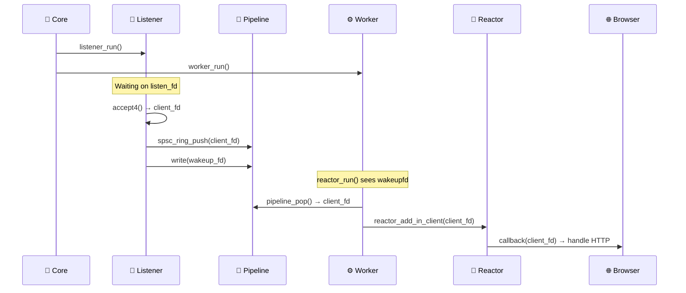

1. **Accept → enqueue → wake‑up**

   * Listener accepts on any ready listen FD.
   * Accepted FD is pushed into the ring buffer.
   * Listener writes `1` to the wakeup_fd.
   * Worker’s epoll is woken, reads the wakeup_fd (counter‑style), drains the ring, and registers the new client FDs.

2. **Back‑pressure**

   * Worker tracks `active_connections_no`.
   * When it crosses `WORKER_MAX_CLIENTS`, the worker sends `WORKER_STATUS_FULL` through the pipe (write end is EPOLLOUT‑armed, one‑shot).
   * Listener reads the pipe, sees the `FULL` flag, and **removes** all listen FDs from epoll (`pause_listening`).
   * As soon as the worker drops below the threshold, it writes `WORKER_STATUS_ACTIVE`, and the listener **re‑adds** the listen FDs (`resume_listening`).

   This feedback loop prevents the accept queue from over‑filling and keeps latency stable under load.

3. **Keep‑alive / idle timeout**

   * Single `timerfd` in the worker ticks every 10 s while at least one client is connected, or every 60 s when the worker is idle.
   * On each tick the worker scans its `connections[]`; sockets idle longer than `WORKER_CLIENT_TIMEOUT_SHORT` are closed gracefully (`shutdown → epoll DEL → close`).

### Why this matters

* **Zero‑copy hand‑off** – Passing raw file descriptors avoids payload copying.
* **Lock‑free** – SPSC ring buffer and eventfd allow wait-free signaling on uncontended paths.
* **Back‑pressure** – Pipe-driven feedback mechanism lets the listener defer accepts, keeping the system responsive.
* **Fully edge‑triggered** – No busy-polling, minimal epoll wake-ups.
* **One timer per worker** – Compact memory usage, constant overhead.

This design enables a tiny, epoll-only micro‑HTTP server to comfortably scale to thousands of concurrent connections while remaining simple, efficient, and restartable without lingering socket issues.

---

## Sockets & threading model

| Channel / Component      | Non‑blocking | Purpose & Behaviour                                                                                                                                                      |                                                                                                                |
| ------------------------ | ------------ | ------------------------------------------------------------------------------------------------------------------------------------------------------------------------ | -------------------------------------------------------------------------------------------------------------- |
| Listener sockets         | **Yes**      | Bound TCP sockets (IPv4/IPv6) set with Nagle's algorithm disabled `TCP_NODELAY`, `SO_REUSEADDR`, `SO_LINGER{0}`, `O_NONBLOCK`, and `IPV6_V6ONLY` (for v6). Monitored via epoll for `EPOLLIN` to drive `accept4()`. |                                                                                                                |
| Ring buffer (L → W)      | N/A          | Lock‑free SPSC queue (`spsc_ring_t`) holding accepted client FDs. Single‑producer (listener), single‑consumer (worker).                                                  |                                                                                                                |
| Eventfd “wakeup” (L → W) | **Yes**      | `eventfd(0, EFD_SEMAPHORE or EFD_NONBLOCK)`. Each write increments a 1‑count semaphore. Worker drains it via `socket_drain()` or `read()`. |
| Pipe (W → L)             | **Yes**      | Unix pipe (`pipe_fds[2]`) with both ends set non‑blocking (`pipe_socket_init`). Worker writes 32‑bit `worker_status` to notify listener.                                 |                                                                                                                |
| Client sockets           | **Yes**      | Each accepted FD is made non‑blocking (`O_NONBLOCK`), `TCP_NODELAY` disables Nagle, optional linger‑off. Monitored via epoll for HTTP I/O.                               |                                                                                                                |
| Timerfd (idle reap)      | **Yes**      | `timerfd_create()` + `timerfd_settime()` via `time_helper`. Fires every 10 s when clients ≥ 1, else every 60 s. Monitored via epoll.                                     |                                                                                                                |

---

## Timeouts & limits

(see `app/include/core/server_settings.h`)

| Symbol                    | Meaning                           | Default   |
| ------------------------- | --------------------------------- | --------- |
| `SERVER_CORE_MAX_LISTENING_SOCKETS`           | Listening sockets (IPv4 + IPv6)   | **2**     |
| `WORKER_MAX_CLIENTS`             | Simultaneous clients (epoll)      | **1024**  |
| `SERVER_CORE_MAX_PENDING_SOCKETS_PER_LISTENER` | `listen()` backlog                | **8**     |
| `SERVER_LOOP_SLEEP_USEC`  | Main loop pause between polls     | **10 s**  |

---

## HTTP capabilities

* **HTTP/1.1 parsing** via **llhttp** in `app/src/browser/http_manager.c`.
  Callbacks (`on_url`, `on_method`, `on_header_field`, `on_header_value`) build an `Http_request_t` struct.
  `determine_connection_policy()` honours `Connection: close`.
* **Request orchestration** in `app/src/browser/browser.c` → `browser_manage_client_req()`.
  Parses → routes → `send_response()` (headers + binary‑safe body).
* **Static file serving** in `app/src/browser/handlers/handler_static.c` – binary‑safe buffer returned to caller (**must free**).

---

## Build details

* **Makefile** auto‑detects all `app/src/` C sources, mirrors the directory tree in `build/obj`, and drops the final binary in `build/bin/`.
* Links static libraries from **`app/external/llhttp/`** and **`app/external/cjson/`** (`-Lapp/external/... -lllhttp -lcjson`).
* **Compilation flags**: `-std=c11 -Wall -Wextra -Werror -pedantic` plus `-g` by default; add `-O0` for *debug* and `-O2 -DNDEBUG` for *release*.
* **Targets**

  * `make` (alias of *debug*) – fast build with symbols
  * `make debug` / `make release`
  * `make run` – launch the server in‑place
  * `make clean` – wipe `build/` and other files.

  * **Static‑analysis helpers**:
    * `make format` – clang‑format all `*.c`/`*.h`
    * `make lint` – `cppcheck` on the whole tree (suppressing missing‑system‑includes)
    * `make tidy` – generate `compile_commands.json` with **bear** and run **clang‑tidy** then clean intermediates
    * `make tidy` leaves **compile\_commands.json** in the repo root so editors (VS Code + clangd) get full‑fledged IntelliSense.
* Every build treats warnings as errors – the CI pipeline must always be green.

---

## Logging semantics

* Log file: **`var/www/server.log`** (overwritten each run)
* Format: `[YYYY‑MM‑DD hh:mm:ss] [LEVEL] message`
* Levels: `INFO`, `ERROR` (extend as you wish)
* Every write is flushed so `tail -f var/www/server.log` shows live traffic.

---

## Git pre‑commit hook

A sample `pre-commit` script (drop it in `.git/hooks/`) enforces the quality gates locally running make lint and make format

Running `git commit` guarantees:

1. *cppcheck* passes with no new issues.
2. All touched C source files follow the project style guide.

---

## Testing matrix

| Scenario                                      | Expected result                                                                                   |
| --------------------------------------------- | ------------------------------------------------------------------------------------------------- |
| Browser `/` + `/assets/style.css` on same TCP socket | Served through keep‑alive; connection persists                                                    |
| Static `/pages/whoami.html` + JS fetch        | HTML delivered; JS fetches `/api/whoami`; clock animates                                          |
| `/pages/drive.html` page                      | JS UI loads; JS fetches `/api/drive`; list renders                                                |
| `/build_notes` page                           | HTML delivered; JS fetches `manifest.json` + notes + diagrams; accordion & PlantUML iframe render |
| JSON `/api/whoami`                            | 200, correct JSON payload, content‑type `application/json`                                        |
| JSON `/api/drive?path=/images`                | 200, array of files (`img1.jpg` …)                                                                |
| 11th parallel client                          | Connection refused (max‑clients = 10)                                                             |
| Client sends `Connection: close`              | Response has `Connection: close`; child exits afterwards                                          |
| Idle >30 s before first request               | Child exits (pre‑handshake timeout)                                                               |
| Idle >120 s after last request                | Child exits (keep‑alive timeout)                                                                  |
| Press `q` in server                           | Parent stops accepting, reaps children, exits cleanly                                             |

---

## Security Concerns

Below is a deep‑dive catalogue of security issues identified in the current multithreaded, event-driven server implementation.  
For each item you will find **the underlying cause**, **the practical impact/attack scenario**, and **actionable mitigations**.

---

### 1. Memory‑ownership mistakes when freeing response bodies

| Aspect     | Details                                                                                                                                                                                                                                                        |
| ---------- | -------------------------------------------------------------------------------------------------------------------------------------------------------------------------------------------------------------------------------------------------------------- |
| **Cause**  | `browser_manage_client_req()` calls `free((void*)response.body)` unconditionally. If helpers like `send_404()` or `send_405()` set `response.body` to a string literal, freeing it is **undefined behaviour**.                                                |
| **Impact** | Crash (DoS) or heap corruption. An attacker may trigger this by requesting a path that causes a literal to be used as the response body.                                                                                |
| **Fixes**  | ① Add a `needs_free` flag to `HttpResponse`. ② Or always duplicate constant strings with `strdup()`. ③ Use a wrapper like `http_resp_set_body(HttpResponse*, const char *src, bool copy)`.                             |

---

### 2. Incomplete HTTP frame parsing (pipelining / request‑smuggling)

| Aspect     | Details                                                                                                                                                                |
| ---------- | ---------------------------------------------------------------------------------------------------------------------------------------------------------------------- |
| **Cause**  | If you pass the whole `recv()` buffer to `llhttp` once and ignore `parser.off`, pipelined requests (multiple HTTP requests in one TCP packet) may be mishandled.        |
| **Impact** | **Request‑smuggling**: an attacker can tunnel extra requests through a keep-alive socket; subsequent handler sees stale state or misroutes.                            |
| **Fixes**  | ① Loop while `parsed < n` and feed remaining bytes into a fresh `llhttp_t`. ② Maintain a per‑connection buffer + offset for incremental parsing.                      |

---

### 3. Path traversal guards are bypassable

| Aspect     | Details                                                                                                                                                                                                                   |
| ---------- | ------------------------------------------------------------------------------------------------------------------------------------------------------------------------------------------------------------------------- |
| **Cause**  | Checks like `if(strstr(path, ".."))` may occur **before URL‑decoding** and don’t cover encoded forms (`..%2f`, `%2e%2e/`).                                                                                                |
| **Impact** | Directory traversal → arbitrary file read, e.g. `GET /assets/..%2f..%2fetc/passwd`.                                                                                                |
| **Fixes**  | ① Always call `url_decode()` **first**. ② Use `realpath()` and verify the result begins with your web‑root. ③ Chroot or drop privileges (`setuid(nobody)`).                        |

---

### 4. Blocking `send()` enables slow‑loris style attacks

| Aspect     | Details                                                                                                                                                                                     |
| ---------- | ------------------------------------------------------------------------------------------------------------------------------------------------------------------------------------------- |
| **Cause**  | If you use blocking `send()` in the worker, a slow client can stall a worker thread.                                                                                                        |
| **Impact** | A few malicious clients can exhaust all worker threads, freezing the service.                                                                         |
| **Fixes**  | ① Set `SO_SNDTIMEO` to a few seconds. ② Or use non-blocking sockets and integrate a `poll()`/`epoll()`-based write loop. ③ Consider `TCP_NODELAY` + write retries.                        |

---

### 5. Large‑file integer truncation

| Aspect     | Details                                                                                                                                                                  |
| ---------- | ------------------------------------------------------------------------------------------------------------------------------------------------------------------------ |
| **Cause**  | Using `ftell()`/`fseek()` and casting to `size_t` can truncate files >2 GiB on 32-bit or with `_FILE_OFFSET_BITS=32`.                                                    |
| **Impact** | Partial file reads or huge allocation attempts → crash.                                                                            |
| **Fixes**  | ① Use `struct stat st; fstat(fileno(file), &st); off_t sz = st.st_size;` ② Add a max file size (e.g. `MAX_STATIC_FILE = 50*1024*1024`).                                 |

---

### 6. Hard‑coded protocol limits

| Aspect     | Details                                                                                                                                                                                                          |
| ---------- | ---------------------------------------------------------------------------------------------------------------------------------------------------------------------------------------------------------------- |
| **Cause**  | `HTTP_RECEIVE_BUFFER_LEN` is 4 KiB, `HTTP_MAX_HEADERS_IN` is 20. Modern browsers can send 10 KiB cookie headers easily.                                                                                        |
| **Impact** | Oversized request truncates in the middle of a header → parse error → vague 400 or crash → trivial DoS.                                                                                                          |
| **Fixes**  | ① Grow the buffer dynamically (`realloc`) until a sane max (e.g. 64 KiB). ② If limit is hit, reply `431 Request Header Fields Too Large`. ③ Stream‑parse with `llhttp_execute()` as bytes arrive.               |

---

### 7. Missing transport‑layer security & privilege separation *(defence‑in‑depth)*

| Aspect     | Details                                                                                                                                                                                                                   |
| ---------- | ------------------------------------------------------------------------------------------------------------------------------------------------------------------------------------------------------------------------- |
| **Cause**  | No TLS, no chroot, no privilege drop.                                                                                                                                                                                    |
| **Impact** | If exposed to the internet, traffic is unencrypted and a compromise is more severe.                                                                                                |
| **Fixes**  | ① Run behind nginx/Caddy for TLS. ② Drop privileges after binding (`setuid(nobody)`). ③ Use chroot/container. ④ Use `seccomp()` or `landlock` to sandbox file system access.        |

---

### 8. Additional concurrency and resource management risks

| Aspect     | Details                                                                                                                                                                                                                   |
| ---------- | ------------------------------------------------------------------------------------------------------------------------------------------------------------------------------------------------------------------------- |
| **Race conditions** | Shared state (e.g. status flags, counters) must be protected with atomics or mutexes. Data races can cause undefined behavior, crashes, or security bugs. **Mitigation:** Audit all shared variables for proper atomic/mutex protection. |
| **Pipe buffer overflow** | If the worker thread is slow or blocked, the listener may fill the pipe buffer and lose client FDs. **Mitigation:** Monitor pipe usage, consider backpressure or a bounded queue. |
| **Resource leaks on thread exit** | If a thread exits abnormally, sockets or memory may not be freed. **Mitigation:** Ensure all cleanup paths are robust; use thread join and error logging. |
| **Unvalidated input in APIs** | JSON and file APIs may not validate all user input (e.g. path, query params). **Mitigation:** Strictly validate and sanitize all user input. |
| **Denial-of-service via many connections** | If `WORKER_MAX_CLIENTS` is too high or not enforced, a flood of connections can exhaust memory or file descriptors. **Mitigation:** Enforce connection caps, monitor resource usage, and consider per-IP limits. |
| **Log injection** | If user input is logged without sanitization, attackers can inject fake log lines. **Mitigation:** Sanitize or escape user input before logging. |

---

### 9. Future counter‑measures checklist

* Enable **ASLR, RELRO, PIE** at compile time (`-fPIE -pie -Wl,-z,relro,-z,now`).
* Ship a **Content‑Security‑Policy** header in every HTML response to curb XSS.
* Add **rate‑limiting** (token bucket per‑IP) on the accept loop to blunt brute‑force traffic.
* Write unit tests that fuzz‑feed headers and URLs through `http_parse_request()` under AddressSanitizer and UndefinedBehaviourSanitizer.
* Consider using a static analysis tool (e.g. cppcheck, clang-tidy) in CI.
* Regularly review and update all dependencies (even static libraries).
* Document and test all error paths and edge cases.

---

## Future work

* Chunked‑encoding & streamed responses
* MIME‑type auto‑detection beyond simple table
* Extended router: POST, PUT, DELETE, HTTP pipelining
* Optional TLS via a minimal OpenSSL wrapper
* WORK IN PROGRESS: Thread‑pool + `epoll`/`kqueue` for higher concurrency
* CLI flags (port, backlog, www dir)
* In‑band metrics (`/api/metrics`) for Prometheus
* Hot‑reload configuration with `inotify`
* Fuzz tests with libFuzzer

Pull requests & ideas welcome — **happy coding!**

---

## Static Architecture

### Core

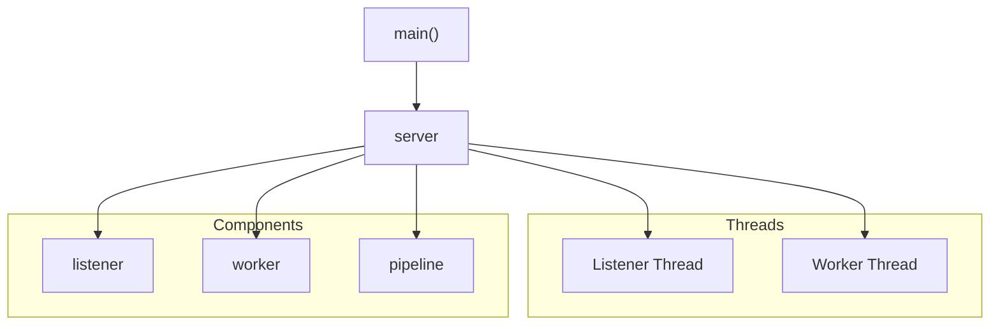

---

### Listener

**Owns:**

* `reactor_t` instance (listener-side epoll)
* `listen_fd`s bounded array
* `pipeline_t` shared pointer

**Responsibilities:**

* Waits on epoll for `EPOLLIN` on listen sockets
* Accepts new clients using `accept4()`
* Initializes sockets (`socket_client_init`)
* Pushes new client FDs into `pipeline_t`
* Reads worker load status updates from `pipe[0]`
* Pauses accepting if worker is full

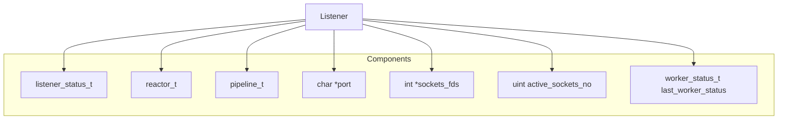

---

### Worker

**Owns:**

* Its own `reactor_t` instance (worker*side epoll)
* `client_manager_t` for tracking active connections
* Timerfd for keep*alives and idle cleanup
* Wakeup `eventfd` (shared via `pipeline_t`)
* Shared `pipeline_t` pointer

**Responsibilities:**

* Monitors for readiness events on client sockets
* On `eventfd` wakeup, drains the SPSC ring buffer
* Registers new FDs in epoll via `reactor_add_in_client`
* Manages read/write/error events via callbacks
* Parses requests and routes them via the browser layer
* Monitors active connections to dynamically update timer intervals
* Signals backpressure to the listener via `pipe[1]` when at capacity

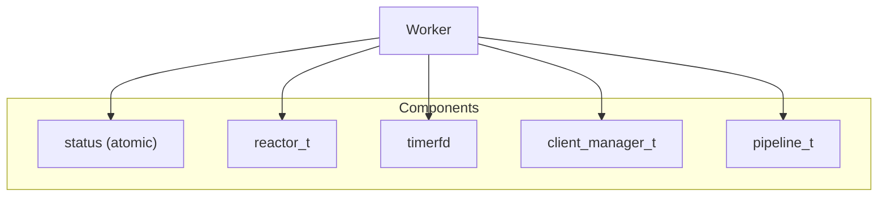

---

### Pipeline

**Owns (internally):**

* `int pipe_fds[2]` for unidirectional signaling (worker → listener)
* `eventfd` for wakeup signaling (listener → worker)
* SPSC ring buffer (`spsc_ring_t*`) for passing accepted client FDs

**Responsibilities:**

* Acts as the bridge between listener and worker
* Transports accepted FDs from listener to worker
* Wakes up the worker via `eventfd`
* Receives worker status updates on `pipe[0]` and delivers them to the listener

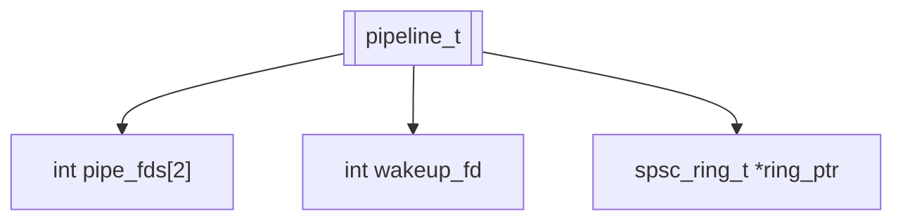

---

### Client Manager

**Owns:**

* A table of active client connection entries (`connection_t[]`)
* FD-to-connection index mapping logic

**Responsibilities:**

* Tracks metadata for each client (FD, last activity, request count)
* Handles socket cleanup and eviction
* Supports load-state checking for backpressure signaling

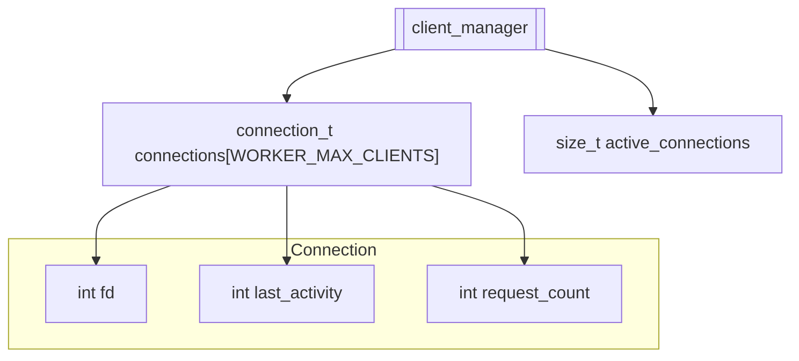

---

### Reactor

**Owns:**

* A single epoll instance
* FD registration table with associated masks, callbacks, and context pointers

**Responsibilities:**

* Only component directly interacting with epoll
* Monitors for readiness events (`EPOLLIN`, `EPOLLOUT`, etc.)
* Dispatches triggered events to their registered callbacks

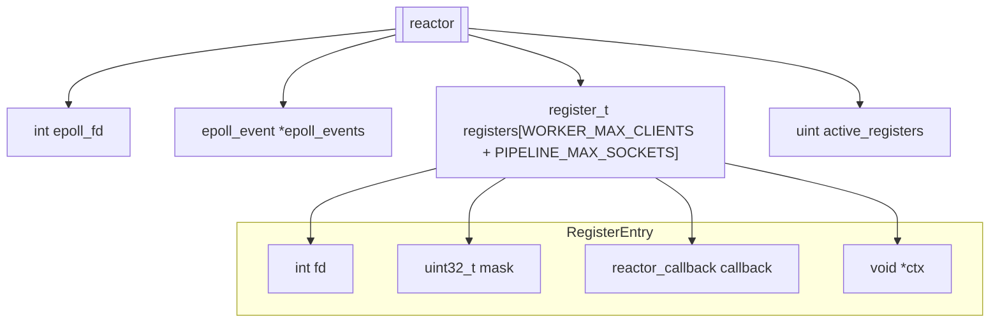

---

### Epoller

This module is stateless and never retains context or state between calls

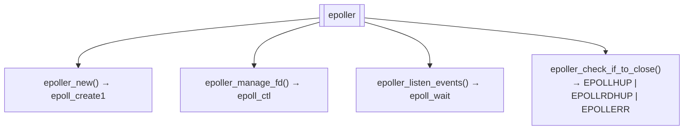

---

## Dynamic Architecture

### Listener → Worker Accept Path

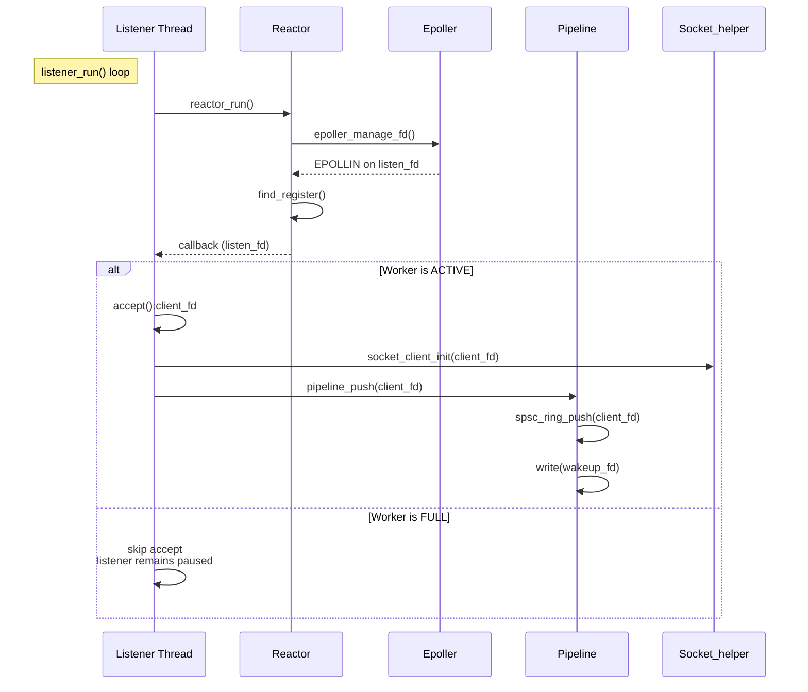

---

### Worker Accept Loop

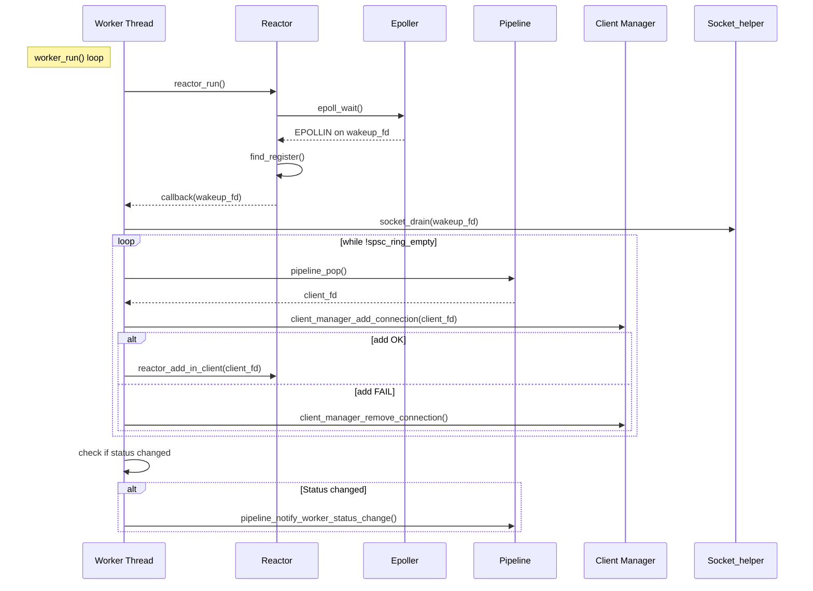

### Listener ↔ Worker Load FSM

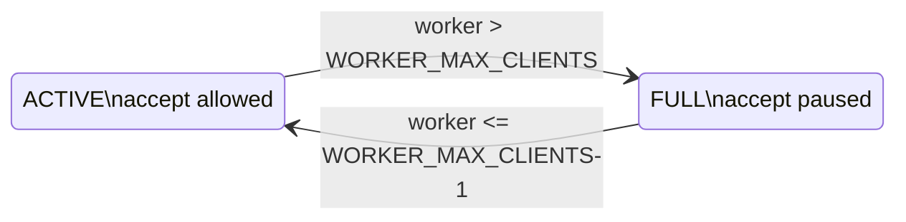

---

#### Browser Layer

**Owns:**

* No persistent state; acts as a request interpreter

**Responsibilities:**

* Parses HTTP/1.1 using `llhttp`
* Dispatches requests based on method + path via a route table
* Handles static content, dynamic APIs, and frontend routing
* Returns JSON, HTML, or file responses depending on endpoint

---
